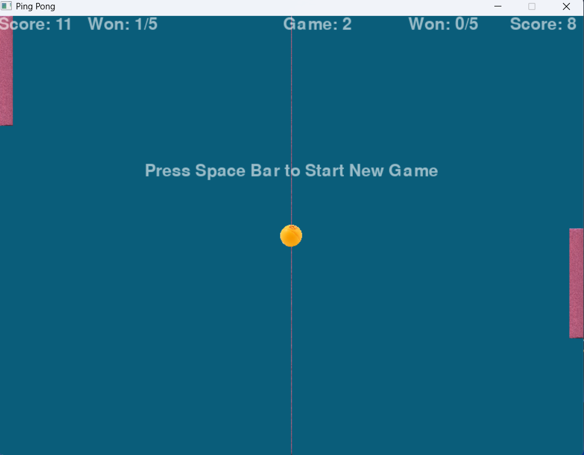
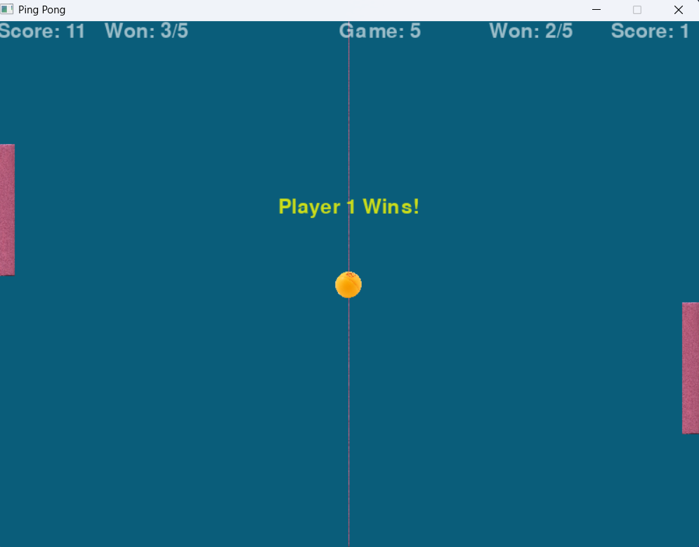

# Table of Contents

1.  [Introduction](#org9b54500)
2.  [Features](#org23c6eb8)
3.  [Technologies Used](#org31dee13)
4.  [Getting Started](#org375d143)
    1.  [Requirements](#org7782445)
    2.  [Installation and Compilation](#org30c15ea)
5.  [Screenshots](#org707ba2d)
6.  [Contributions](#orgd43b91b)
7.  [Authors](#orgfae636a)
8.  [Licence](#orgd9ff7c3)

# Introduction

This is my implementation of a simple ping pong game in C. It allows two players
to compete in a tabel tennis game while keeping track of scores. The games follows the rules
of ping pong. It ensures that a player wins by at least 2 points. The match is
won following a best of 5 games.

# Features

-   Score tracking for two players
-   Automatic handling of deuces
-   Easy installation both Linux and Windows systems

# Technologies Used

-   C
-   Linux
-   Windows

# Getting Started

## Requirements

C compilers such as

-   GCC
-   Clang
-   MinGW(for Windows)

## Installation and Compilation

1.  Clone the repo:

    git clone https://github.com/fk2019/Ping_Pong.git
    cd Ping_Pong

1.  Compile the program and run the game

    make
    ./game.exe

1.  Play and enjoy the game

# Screenshots

A game win

A match win

# Contributions

Please feel free to fork and make contributions to the game.

# Authors

Francis is a skilled Software Engineer keen on making great programs. Reach out to [Francis](mailto:fkmuiruri8@gmail.com) for any opportunities and collaborations.

# Licence

This project is licensed under the terms of the MIT license. Please see the [LICENSE](file:///Ping_Pong/LICENCE.txt) file for more details.

